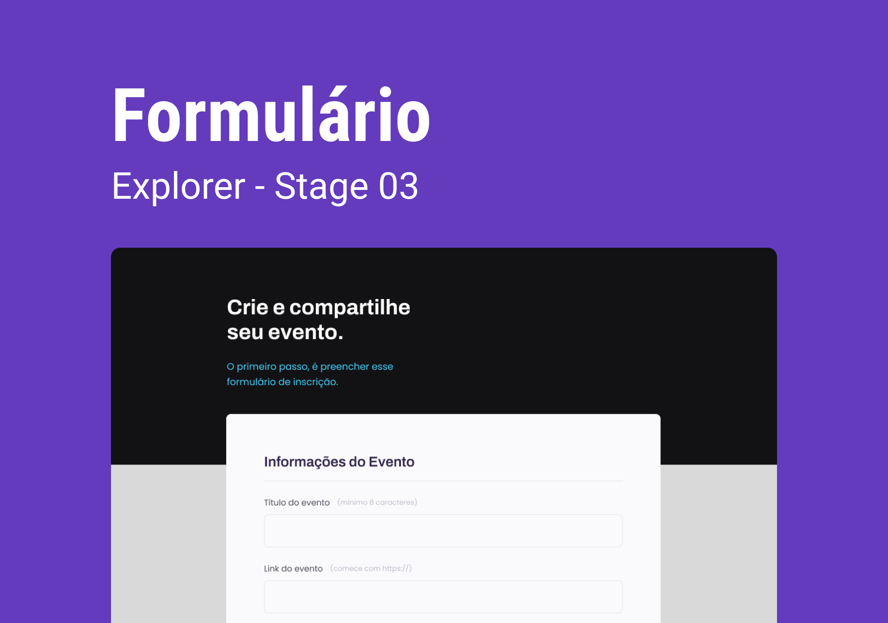

<h1 align="center">Formulário</h1>

  Projeto retirado do programa Explorer, um programa de estudo exclusivo promovido pela Rocketseat para o ensino de tecnologias web.

  <a href="#-layout">Layout</a>&nbsp;&nbsp;&nbsp;|&nbsp;&nbsp;&nbsp;
  <a href="#-aprendizado">Aprendizado</a>&nbsp;&nbsp;&nbsp;|&nbsp;&nbsp;&nbsp;
  <a href="#-projeto">Projeto</a>&nbsp;&nbsp;&nbsp;|&nbsp;&nbsp;&nbsp;
  <a href="#-tecnologias">Tecnologias</a>&nbsp;&nbsp;&nbsp;|&nbsp;&nbsp;&nbsp;
  <a href="#-licença">Licença</a>

 

  

 

  

## 🎨 Layout

Você pode visualizar o layout do projeto através [DESSE LINK](https://www.figma.com/file/sgcJKpGAeVqh7rf2pwsOd9/Explorer-Stage-03-Projeto-01/duplicate).

## 📖 Aprendizado

- Aperfeiçoei meus conhecimentos em formulários e inputs;
- Dominei a formatação de formulários utilizando o Tailwind CSS;
- Aprendi a utilizar a tag "select" de forma eficiente;
- Aprendi a aproveitar ao máximo a tag "textarea".

## 💻 Projeto

Este projeto tem como objetivo proporcionar uma experiência prática na construção de formulários utilizando as tecnologias HTML, CSS e Tailwind CSS. O projeto visa a compreender e dominar os conceitos fundamentais dos formulários dentro do HTML, enquanto aproveitam a praticidade e eficiência do Tailwind CSS para estilização.

## 🧪 Tecnologias

Esse projeto foi desenvolvido com as seguintes tecnologias:

- [HTML](https://developer.mozilla.org/pt-BR/docs/Web/HTML)
- [TailwindCSS](https://tailwindcss.com)
- [NPM](https://www.npmjs.com)
- [Git](https://git-scm.com)
- [Figma](https://www.figma.com)
- [ICONS8](https://icons8.com)

## 📝 Licença

Este projeto está sob a licença MIT. Consulte o arquivo [LICENSE](https://github.com/kauankarvalho/Formulario/blob/main/LICENSE) para obter mais detalhes.
